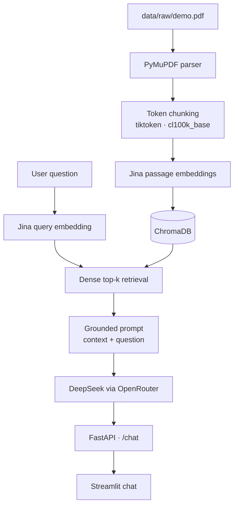

# ExCort

ExCort là chatbot Retrieval-Augmented Generation (RAG) ở mức MVP dành cho một
tài liệu PDF. Dự án tự triển khai toàn bộ pipeline parsing, chunking, embedding,
retrieval và generation, không sử dụng LangChain hoặc LlamaIndex.

## Tính năng MVP

- Đọc PDF có text bằng PyMuPDF và giữ metadata số trang.
- Chia văn bản theo cửa sổ token cố định bằng `cl100k_base`, có overlap.
- Tạo embedding bằng `jina-embeddings-v5-omni-small` qua Jina API.
- Lưu và tìm kiếm dense vector bằng ChromaDB với cosine distance.
- Sinh câu trả lời có nguồn trang bằng `deepseek/deepseek-v4-flash-0731` qua
  OpenRouter.
- Cung cấp REST API bằng FastAPI và giao diện chat bằng Streamlit.
- Có script quan sát riêng cho từng phase và bộ test chạy offline với mock API.

## Kiến trúc



Pipeline chỉ dùng dense search. Reranking, BM25 và các RAG framework đóng gói
không nằm trong phạm vi MVP.

## Công nghệ

| Thành phần | Công nghệ |
|---|---|
| Runtime | Python 3.12 |
| Package manager | uv |
| Configuration | pydantic-settings + `.env` |
| PDF parsing | PyMuPDF |
| Chunking | tiktoken (`cl100k_base`) |
| Embedding | Jina API |
| Vector database | ChromaDB |
| LLM | OpenRouter / DeepSeek |
| Backend | FastAPI |
| Frontend | Streamlit |
| Testing và quality | pytest + Ruff |

## Yêu cầu

- Python 3.12 (uv có thể tự quản lý đúng phiên bản từ `.python-version`).
- [uv](https://docs.astral.sh/uv/) đã được cài đặt.
- `JINA_API_KEY` có quyền gọi Jina Embeddings API.
- `OPENROUTER_API_KEY` có quyền gọi model được cấu hình.
- Một PDF có text mà bạn có quyền sử dụng.

PDF scan không có text layer chưa được hỗ trợ vì MVP không có OCR.

## Cài đặt

```bash
git clone <repository-url>
cd ExCort
uv sync
cp .env.example .env
mkdir -p data/raw
```

Mở `.env` và điền tối thiểu:

```dotenv
OPENROUTER_API_KEY=your_openrouter_key
JINA_API_KEY=your_jina_key
```

Đặt PDF tại:

```text
data/raw/demo.pdf
```

`demo.pdf`, `.env`, chunks đã xử lý và ChromaDB local đều được Git ignore để
tránh commit khóa bí mật, dữ liệu có bản quyền hoặc artifact sinh tự động.

## Cấu hình

| Biến | Mặc định | Ý nghĩa |
|---|---|---|
| `OPENROUTER_API_KEY` | rỗng | Khóa gọi OpenRouter; bắt buộc khi generation |
| `JINA_API_KEY` | rỗng | Khóa gọi Jina; bắt buộc khi embedding/retrieval |
| `OPENROUTER_MODEL` | `deepseek/deepseek-v4-flash-0731` | Model sinh câu trả lời |
| `JINA_EMBEDDING_MODEL` | `jina-embeddings-v5-omni-small` | Model embedding |
| `PDF_PATH` | `data/raw/demo.pdf` | Đường dẫn PDF nguồn |
| `CHROMA_PATH` | `data/chroma` | Thư mục ChromaDB persistent |
| `CHROMA_COLLECTION` | `excort_documents` | Tên collection |
| `CHUNK_SIZE` | `500` | Số token tối đa mỗi chunk |
| `CHUNK_OVERLAP` | `50` | Số token overlap giữa hai chunk cùng trang |
| `TOP_K` | `4` | Số chunk đưa vào prompt |
| `BACKEND_URL` | `http://127.0.0.1:8000` | URL FastAPI mà frontend gọi |

`CHUNK_OVERLAP` phải nhỏ hơn `CHUNK_SIZE`.

## Tạo chỉ mục

Chạy ingestion và embedding theo thứ tự:

```bash
uv run python scripts/phase1_check.py
uv run python scripts/phase2_check.py
```

Phase 1 tạo `data/processed/chunks.json`. Phase 2 gọi Jina, sau đó tạo lại
collection tại `data/chroma` để không giữ record cũ khi tái lập chỉ mục.

Có thể kiểm tra retrieval và generation độc lập:

```bash
uv run python scripts/phase3_check.py \
  --query "What is the relationship between MLOps and ML systems design?"

uv run python scripts/phase4_check.py \
  --question "What is MLOps?"
```

## Chạy ứng dụng

Khởi động backend trong terminal thứ nhất:

```bash
uv run uvicorn excort.api:app --reload
```

Khởi động frontend trong terminal thứ hai:

```bash
uv run streamlit run src/excort/frontend.py
```

Các địa chỉ mặc định:

- Streamlit UI: `http://localhost:8501`
- FastAPI: `http://localhost:8000`
- OpenAPI/Swagger: `http://localhost:8000/docs`

## API

### `GET /health`

Kiểm tra backend có mở được Chroma collection hay không:

```bash
curl http://127.0.0.1:8000/health
```

Ví dụ response:

```json
{
  "status": "ok",
  "collection": "excort_documents",
  "record_count": 38
}
```

### `POST /chat`

```bash
curl -X POST http://127.0.0.1:8000/chat \
  -H "Content-Type: application/json" \
  -d '{"question":"What is MLOps?","top_k":4}'
```

Response gồm `question`, `answer` và danh sách `sources`. Mỗi source chứa chunk
ID, đường dẫn tài liệu, số trang, similarity và nội dung chunk dùng làm bằng chứng.
`top_k` là tùy chọn và phải nằm trong khoảng 1–20.

## Kiểm thử và code quality

Chạy toàn bộ quality gate offline:

```bash
uv run python scripts/phase7_check.py
```

Hoặc chạy từng công cụ:

```bash
uv run pytest -q
uv run ruff check .
uv run ruff format --check .
```

Các unit test mock Jina và OpenRouter nên không sử dụng API key hoặc phát sinh
chi phí. Các script quan sát Phase 2–6 là integration checks và có thể gọi dịch vụ
thật.

## Script quan sát theo phase

| Phase | Script | Nội dung kiểm tra |
|---|---|---|
| 0 | `scripts/phase0_check.py` | Môi trường, cấu trúc và config |
| 1 | `scripts/phase1_check.py` | Parsing, số chunk, token count và sample |
| 2 | `scripts/phase2_check.py` | Embedding dimension, Chroma count và query thô |
| 3 | `scripts/phase3_check.py` | Dense top-k và similarity |
| 4 | `scripts/phase4_check.py` | Prompt cuối và câu trả lời RAG |
| 5 | `scripts/phase5_check.py` | FastAPI `/health` và `/chat` qua HTTP thật |
| 6 | `scripts/phase6_check.py` | Luồng chat Streamlit end-to-end |
| 7 | `scripts/phase7_check.py` | pytest, Ruff và Git whitespace |

## Cấu trúc dự án

```text
ExCort/
├── data/
│   ├── raw/                 # PDF do người dùng cung cấp
│   ├── processed/           # chunks.json sinh từ Phase 1
│   └── chroma/              # vector database local
├── scripts/                 # script quan sát Phase 0–7
├── src/excort/
│   ├── api.py               # FastAPI endpoints
│   ├── config.py            # pydantic-settings
│   ├── embeddings.py        # Jina HTTP client
│   ├── frontend.py          # Streamlit UI
│   ├── generation.py        # prompt và OpenRouter client
│   ├── ingestion.py         # PDF parsing và token chunking
│   ├── rag.py               # orchestration retrieval → generation
│   ├── retrieval.py         # dense top-k retrieval
│   ├── schemas.py           # API schemas
│   └── vector_store.py      # Chroma persistence
└── tests/                   # unit/API tests chạy offline
```

## Xử lý lỗi thường gặp

- `PDF not found`: kiểm tra `PDF_PATH` và đảm bảo `data/raw/demo.pdf` tồn tại.
- `JINA_API_KEY is missing`: điền khóa Jina vào `.env`, sau đó chạy lại Phase 2.
- `OPENROUTER_API_KEY is missing`: điền khóa OpenRouter trước khi chạy RAG/API.
- `Vector collection is unavailable`: chạy Phase 1 rồi Phase 2 để tạo lại index.
- Frontend báo backend unavailable: khởi động Uvicorn và kiểm tra `BACKEND_URL`.

## Giới hạn hiện tại

- Chỉ hỗ trợ PDF có text; PDF scan cần OCR ngoài phạm vi MVP.
- Chỉ lập chỉ mục một PDF và rebuild toàn bộ collection khi chạy lại Phase 2.
- Retrieval chỉ dùng dense search, chưa có reranking hoặc hybrid search.
- Lịch sử chat chỉ tồn tại trong Streamlit session và không được lưu lâu dài.
- Chất lượng câu trả lời phụ thuộc nội dung PDF và dịch vụ model bên ngoài.
- Jina/OpenRouter yêu cầu mạng và có thể phát sinh chi phí sử dụng.

## Future work

- Bổ sung reranking bằng Jina Reranker.
- Bổ sung logging có cấu trúc bằng Loguru.
- Bổ sung đánh giá RAG bằng Ragas.
- Lưu lịch sử chat bằng SQLite.
- Đóng gói deployment bằng Docker.
- Bổ sung BM25 để hỗ trợ Hybrid Search.
